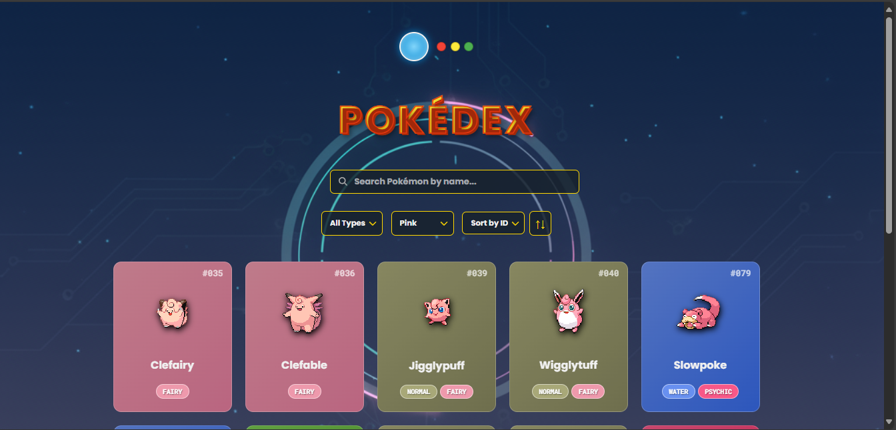
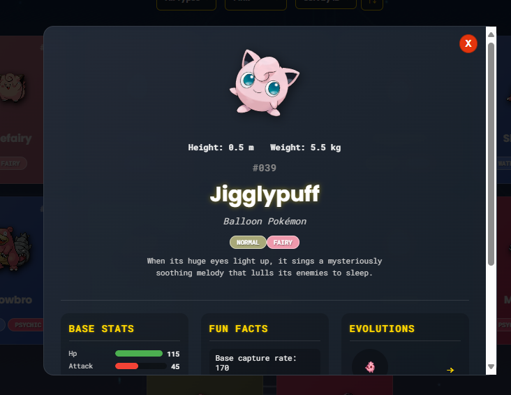

#  Pokédex - Desafio DIO 🚀


> **Desafio do Bootcamp Ri Happy - Front-end do Zero #2 da [Digital Innovation One (DIO)](https://www.dio.me/).**

## 📖 Sobre o Projeto

Este projeto é uma Pokédex interativa e moderna, desenvolvida para listar, filtrar e exibir detalhes dos 151 Pokémon da primeira geração. O objetivo foi criar uma aplicação web funcional, visualmente atraente e com uma experiência de usuário rica, utilizando HTML, CSS e JavaScript puros, e consumindo dados da [PokeAPI](https://pokeapi.co/).

A aplicação se destaca por sua interface gamificada, animações fluidas e ferramentas de pesquisa avançadas, demonstrando competências em manipulação do DOM, consumo de APIs e design responsivo.

### ✨ [Veja o projeto ao vivo!](https://annykaah.github.io/pokedex-challenge)

---

## 🎬 Demonstração

| Animação de Abertura | Visualização Principal | Detalhes do Pokémon |
| :---: | :---: | :---: |
|  |  |  |

---

## 🛠️ Funcionalidades

-   ✅ **Tela de Abertura Imersiva:** Animação de uma Pokebola se abrindo para revelar as instruções e iniciar a aplicação.
-   ✅ **Listagem Dinâmica:** Carregamento assíncrono dos 151 Pokémon via PokeAPI.
-   ✅ **Cards Interativos:** Efeito de "virar o card" ao clicar em um Pokémon, revelando o modal de detalhes.
-   ✅ **Busca em Tempo Real:** Filtre os Pokémon instantaneamente pelo nome.
-   ✅ **Filtros Avançados:** Filtre a lista por tipo de Pokémon (Fogo, Água, Grama, etc.).
-   ✅ **Ordenação Flexível:** Ordene os Pokémon por ID, Nome, Altura ou Peso.
-   ✅ **Inversão de Ordem:** Um botão permite alternar a ordenação entre ascendente e descendente.
-   ✅ **Modal de Detalhes Completo:** Ao clicar em um card, um modal exibe informações detalhadas, incluindo:
    -   Status base com barras de progresso.
    -   Curiosidades (gênero, se é lendário/mítico, taxa de captura).
    -   Cadeia de evolução.
-   ✅ **Design Responsivo:** A interface se adapta perfeitamente a diferentes tamanhos de tela, de desktops a celulares.

---

## 💻 Tecnologias Utilizadas

-   **HTML5:** Estrutura semântica e acessível.
-   **CSS3:** Estilização moderna, animações complexas (`@keyframes`, `transform`), Flexbox e Grid Layout.
-   **JavaScript (ES6+):** Manipulação do DOM, consumo de API com `async/await`, lógica de filtros e ordenação.
-   **PokeAPI:** Fonte de dados para todos os Pokémon, tipos, evoluções e outras informações.
-   **Git & GitHub:** Controle de versão e hospedagem do código.

---

## 🚀 Como Executar o Projeto

Para rodar este projeto localmente, siga os passos abaixo:

```bash
# 1. Clone o repositório
git clone https://github.com/AnnyKaah/pokedex-challenge.git

# 2. Navegue até o diretório do projeto
cd pokedex-challenge

# 3. Abra o arquivo `index.html` no seu navegador de preferência.
# E pronto! A Pokédex estará funcionando.

```
---

##  👨‍💻 Autor
Feito com ❤️ por Anny Karoline

[Linkedin](https://www.linkedin.com/in/annykarolinedecarvalhomartins/) | [Github](https://github.com/AnnyKaah/)

---

## Agradecimentos

Agradeço à Ri Happy e à Digital Innovation One pela oportunidade e pelo desafio proposto no bootcamp, que foi fundamental para aprimorar minhas habilidades em desenvolvimento front-end.

---

